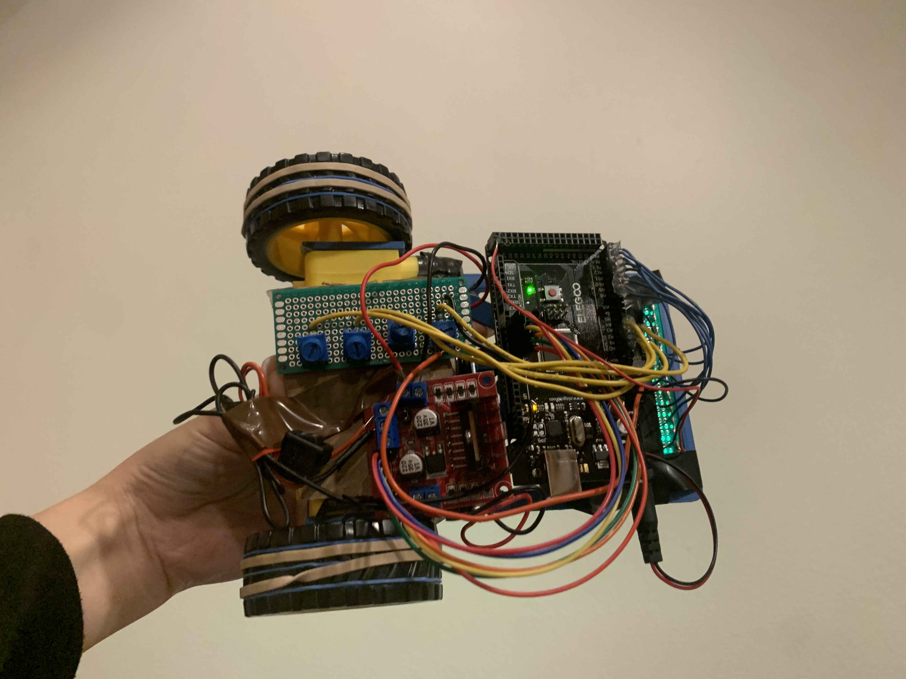
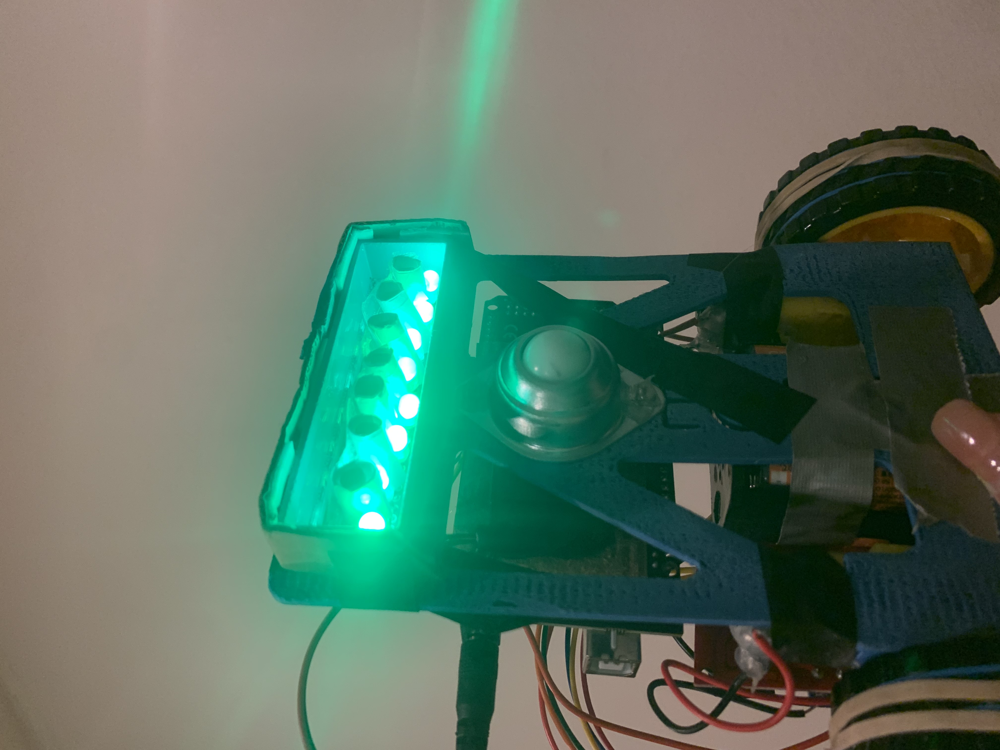
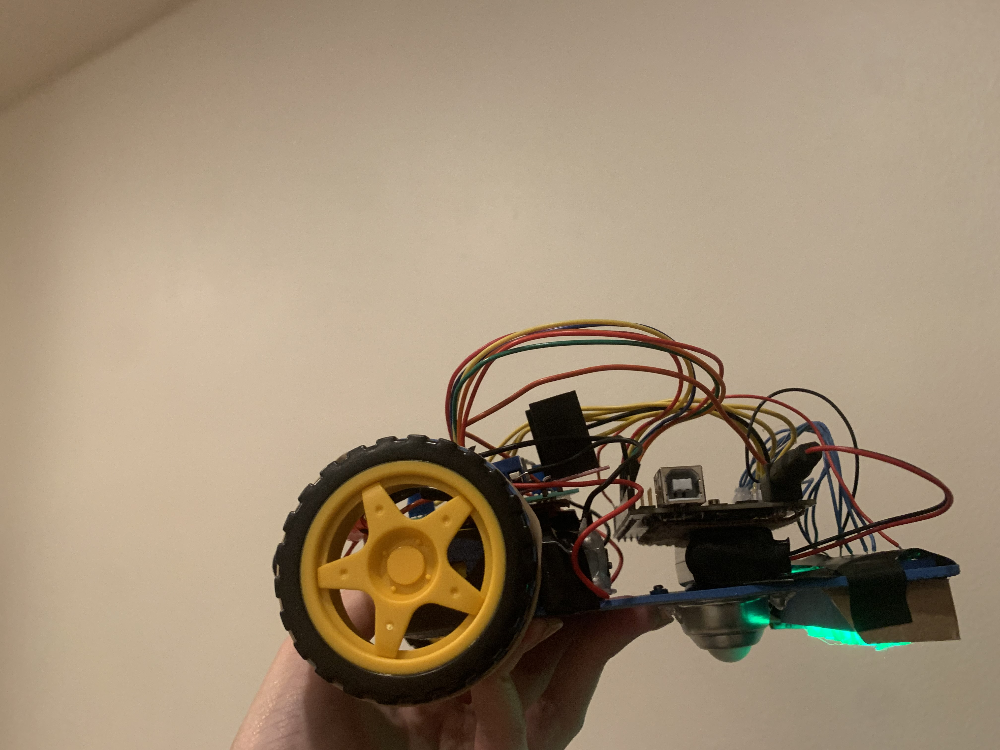
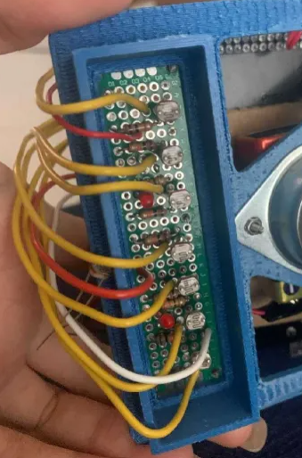
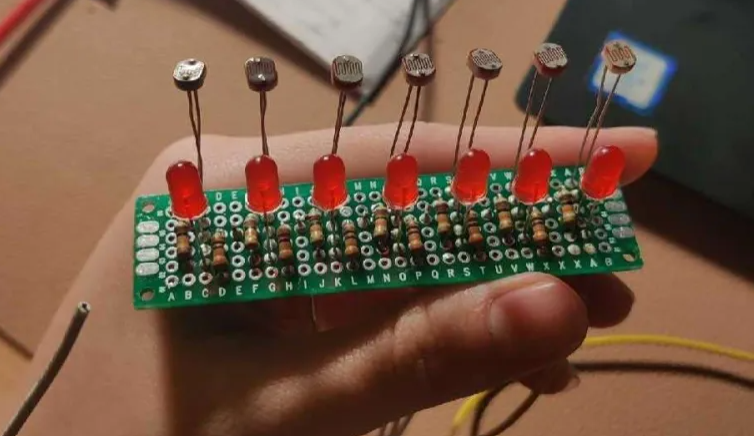

# Lab 4 - Robotics 
**Team 9**

Ethan Kook, Anthony Sanchez, Minh Quach, Ashlee Young

## Robot Building Section
**Prototype**

[Link to video of robot following line](https://drive.google.com/file/d/1XIXKW4T9IK9aXX4_kKRFaj5XQgYtlbYv/view?usp=sharing)

## Final Robot
*soldered protoboards for smaller and lighter load*

*switch to turn motor on and off*

*LEDS for underglow and for better and more consistent photoresister readings*

## Explanation of PID values
For the circuit track, we had a high `NOMINALSPEED` value of 90 and adjusted our `S` to be about 75. Our main tuning was the `P` value which we increased proportionally to the speed, turning them both by the same amount everytime we wanted to go faster.

For the actual lemon track on the race day, we initialized our `NOMINALSPEED` to 40 and set our `I` and `D` values to 0. We then adjusted our `S` to be about 50 by the potentiometer values and adjusted our `P` values to be about 50 ish as well. If the robot went too fast, it would go off track but if it went too slow, it wouldn't be able to move at all. We adjusted our `D` value very minimally to just squeeze in 9 laps before the robot collapsed at the sensor. 

For the drag race, because it was a straight line, we had our `NOMINALSPEED` value at its max of 100 (though when we actually did the race it was 110). Our `I` and `D` values were set to 0. Because `I` was so small in the code, it didn't seem to change our performance on the tracks as much though the reason could have been that when we were tuning the days before, we made the mistake of tuning multiple things at once. We basically full sent our robot with the `S` value at max and a `P` value at about 40 though any tuning did not really seem to be required since it was mostly a straigt line.

Finally, for the frequency track, we did a lot worse than expected. We set our `S` value to be about 40-50 while our `NOMINALSPEED` value was at around 35. We initially had trouble getting past even the 3rd checkpoint and we continuously adjusted the `P` and `D` values together to be able to follow the line better and also to both better follow the line and to also stop wobbling as much. Our `I` value was also adjusted as a last ditch effort to try to get past the 6th checkpoint but we failed to finish. 

## Poster

## Competition Scores
**Drag Race** 
3rd Place, Best time: 10.23s

**Frequency Track**
Distance: 6, Time: 2:55, Rank: 9

**Loop**
9 loops, 4th place

## Videos from competition day
[Link to videos on google drive](https://drive.google.com/drive/u/2/folders/1gGlPgxhtZnbpn68bcWfV5KM_cQos1q3o)

## Team Picture

## Final Improvements
During week 9, our robot was barely able to follow the line. Our chassis was the wrong fit, though our photoresistors and potentiometers were soldered onto a board, the photoresistors were too high off the ground and were unable to differentiate between the black and white values very well (though our delta values were around 100) and we lacked a light shield.

After failing to complete a loop on the end of week 9, we realized we needed to do a lot of work on our robot. We resoldered the photoresistors like 4 times because we kept making adjustments to the height and added first two LEDs and then seven LEDs and finally ended with eight. 

Below are examples of two previous iterations of our boards: 

This board had two LEDs. 

This board had seven LEDs.

We realized that since we needed the photoresistors to be a little less than an inch long off the board, we carefully soldered the desired lengths and tried to make them as even and straight as possible. From there, we also got better fitting wires that didn't require us to shove them into the arduino. 

In the days leading up to the competition, we continued to test our design by running different PID values on the loop tracks. We hit a very good run on the Wednesday lab in week 10 but unfortunately, due to us changing the battery the next day, we had to reset all our written down PID values and recalibrate everything since our new batteries made it much faster and as a result less accurate. We also had to change back our base speed values from 90 back to 50. To ensure that nothing was out of place for the competiton, we hot glued the wires to the arduino.

We attempted to modify our code so that our robots could run more smoothly if there were weird curves or sharp edges but we realized that it made our runs worse and we didn't have enough time to test and debug our code. Additionally, even though our robot worked well and could go several laps around the circuit track (which was our main means of testing it), we found that more often then not, there would be times when our robot would suddenly not detect a line and not change its path when its previous rounds around the track had been smooth. To fix this issue, we just went slower.

After the competiton, it became apparent that because our batteries were buried beneath all our hardware and glued and taped, we were unable to compete against the first and second place teams. The amount of practicing that we had done during the previous day and morning of the race had used up some of our voltage and our battery was around 8 V compared to the brand new batteries of the other two teams.

