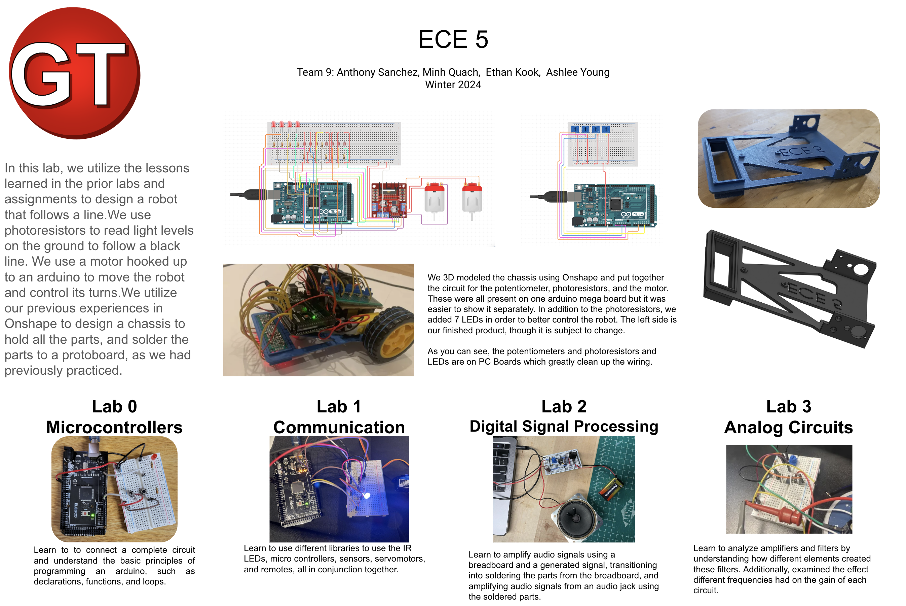

# Lab 4 - Robotics 
**Team 9**

Ethan Kook, Anthony Sanchez, Minh Quach, Ashlee Young

## Robot Building Section
**Prototype**

[Link to video of robot following line](https://drive.google.com/file/d/1XIXKW4T9IK9aXX4_kKRFaj5XQgYtlbYv/view?usp=sharing)

## Final Robot
*soldered protoboards for smaller and lighter load*

*switch to turn motor on and off*

*LEDS for underglow and for better and more consistent photoresister readings*

## Explanation of PID values
*What PID values did you choose and why*
*How did you adjust Speed and PID for diff tracks*
*Delete these ^*

## Poster

## Competition Scores
**Drag Race** 
3rd Place, Best time: 10.23s

**Frequency Track**
??

**Loop**
9 loops, 4th place

## Videos from competition day
[Link to videos on google drive](https://drive.google.com/drive/u/2/folders/1gGlPgxhtZnbpn68bcWfV5KM_cQos1q3o)

## Team Picture

## Final Improvements
*4-6 sentences on improcements made during the last week and improvents (delete this)*

